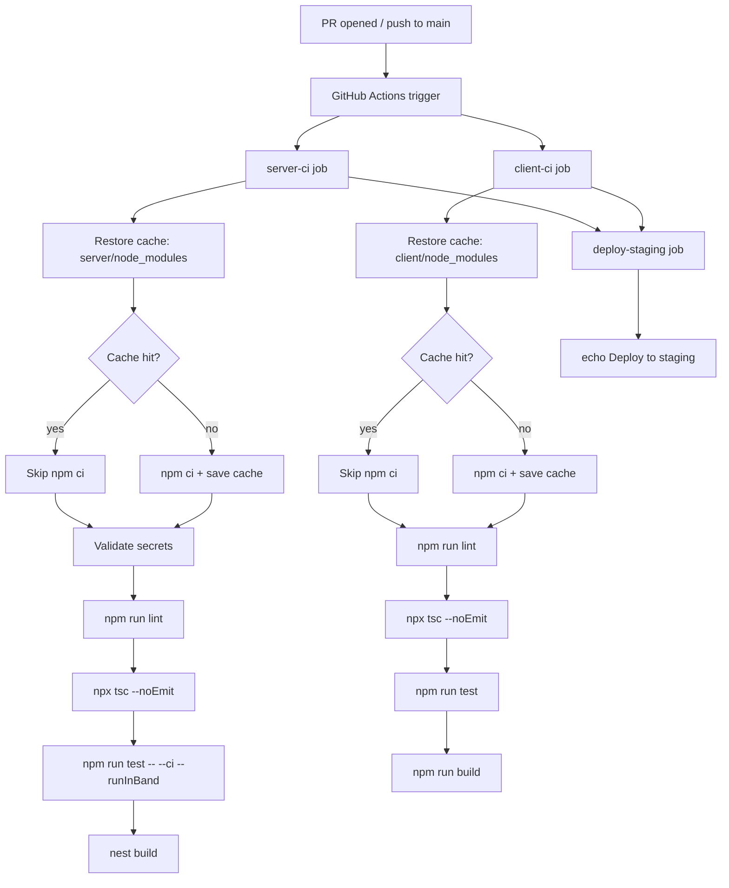
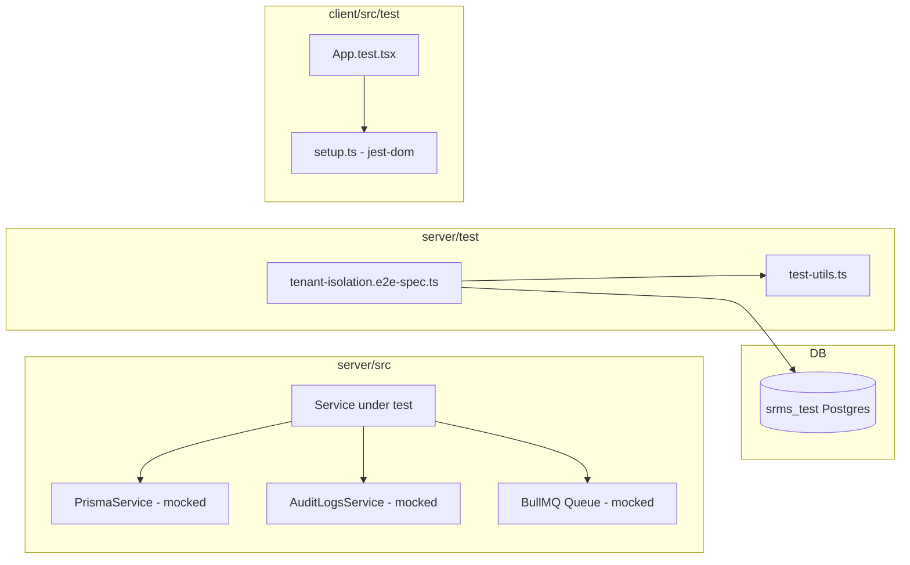

# Design Document

## Feature: gradellence-cicd-testing

---

## Overview

This design covers the Phase 7 testing and CI/CD gap closure for the GRADELLENCE multi-tenant School Result Management System. Three independent deliverables are addressed:

1. **GitHub Actions CI/CD Pipeline** — a `ci.yml` workflow that validates every pull request and push to `main` with lint, type-check, test, and build steps for both workspaces, plus a gated deploy-staging placeholder.
2. **Backend Unit Tests** — Jest spec files for eleven service modules that currently have no coverage, with special attention to tenant-scoping filters, exception paths, audit-log call assertions, and transaction usage.
3. **HTTP-Level Tenant-Isolation Integration Tests** — a Supertest e2e suite that boots a real NestJS app against `srms_test`, registers two independent school accounts, and proves that School A's JWT cannot read or mutate School B's data across every guarded endpoint.
4. **Client-Side Test Infrastructure** — Vitest + React Testing Library wired into the React/Vite workspace, with jsdom, path-alias resolution, a `jest-dom` setup file, and a passing App smoke test.

The feature requires no new API endpoints and no schema changes. It is purely additive: new files in `.github/workflows/`, `server/src/modules/**/*.spec.ts`, `server/test/`, and `client/src/test/`.

---

## Architecture

### CI/CD Pipeline Flow



### Test Architecture



### Test Database Strategy

The e2e suite targets a dedicated database named `srms_test`. The `DATABASE_URL` in the CI environment must point to this database. The `cleanupDatabase` helper in `server/test/test-utils.ts` issues `TRUNCATE … CASCADE` on all tenant-scoped tables in dependency order, ensuring a clean state between suite runs.

Unit tests never touch a real database — every Prisma method is replaced with `jest.fn()` returning controlled values, keeping unit tests fast and deterministic.

---

## Components and Interfaces

### 1. `.github/workflows/ci.yml`

**Triggers:** `push` to `main`, `pull_request` targeting `main`.

**Jobs:**

| Job name | Runs on | Key steps | Secrets injected |
|---|---|---|---|
| `server-ci` | `ubuntu-latest` | restore cache → validate secrets → lint → typecheck → test → build | `DATABASE_URL`, `JWT_SECRET`, `JWT_REFRESH_SECRET` |
| `client-ci` | `ubuntu-latest` | restore cache → lint → typecheck → test → build | — |
| `deploy-staging` | `ubuntu-latest` | echo placeholder | — |

**Cache strategy:** `actions/cache` keyed on `hashFiles('server/package-lock.json')` for the server workspace and `hashFiles('client/package-lock.json')` for the client. The `npm ci` step is wrapped in a conditional so it is skipped on cache hit.

**Secret validation step (server-ci):** A shell step runs before any test step:
```bash
if [ -z "$DATABASE_URL" ] || [ -z "$JWT_SECRET" ] || [ -z "$JWT_REFRESH_SECRET" ]; then
  echo "ERROR: Required secret(s) missing: DATABASE_URL, JWT_SECRET, JWT_REFRESH_SECRET"
  exit 1
fi
```
This ensures a missing secret produces a clearly labelled failure rather than a silent wrong-result test run.

**deploy-staging dependency:** `needs: [server-ci, client-ci]` so the deploy job is blocked until both pass.

---

### 2. Backend Unit Test Spec Files

Each spec file follows the same structural pattern:

```
server/src/modules/<module>/<module>.service.spec.ts
```

**Pattern:**
```typescript
import { Test, TestingModule } from '@nestjs/testing';
import { XxxService } from './xxx.service';
import { PrismaService } from '../../database/prisma.service';
// ... other deps

describe('XxxService', () => {
  let service: XxxService;
  let prisma: jest.Mocked<PrismaService>;

  beforeEach(async () => {
    const module: TestingModule = await Test.createTestingModule({
      providers: [
        XxxService,
        { provide: PrismaService, useValue: createPrismaMock() },
        // ... other mocked providers
      ],
    }).compile();

    service = module.get<XxxService>(XxxService);
    prisma = module.get(PrismaService);
  });

  it('...', async () => { ... });
});
```

**Mocking strategy:**
- `PrismaService`: replaced with a plain object where every method used by the service under test is a `jest.fn()`.
- `AuditLogsService`: replaced with `{ logAction: jest.fn().mockResolvedValue(undefined) }`.
- `BullMQ Queue` (TeachersService, AuthService): replaced with `{ add: jest.fn().mockResolvedValue(undefined) }`.
- `JwtService` (AuthService): replaced with `{ sign: jest.fn().mockReturnValue('mock-token') }`.
- `ConfigService` (AuthService): replaced with `{ get: jest.fn().mockReturnValue('15m') }`.
- `RedisService` (AuthService): replaced with `{ storeRefreshToken: jest.fn(), deleteRefreshToken: jest.fn(), getRefreshToken: jest.fn() }`.

**Spec files to create (11 total):**

| File | Key assertions |
|---|---|
| `enrollments.service.spec.ts` | `findAll` where clause, `findOne` NotFoundException, `create` NotFoundException/ConflictException/BadRequestException |
| `assessments.service.spec.ts` | `findAll` where clause, `findOne` NotFoundException, `create` ForbiddenException (no subscription, over limit, score > maxScore), `create` logAction `SCORE_CREATED` |
| `classes.service.spec.ts` | `findAll` where clause, `findOne` NotFoundException, `remove` BadRequestException on enrollments |
| `sessions.service.spec.ts` | `findAllSessions` where clause, `findOneSession` NotFoundException, `createSession` BadRequestException on inverted dates |
| `subjects.service.spec.ts` | `findAll` where clause, `create` ConflictException on duplicate code, `findOne` NotFoundException |
| `students.service.spec.ts` | `findAll` where clause, `findOne` NotFoundException, `remove` soft delete (sets `deletedAt`), `promoteStudents` uses `$transaction` |
| `users.service.spec.ts` | `findAll` schoolId filter for SCHOOL_ADMIN, `findOne` ForbiddenException, `create` ForbiddenException, `update` logAction `ROLE_CHANGED` |
| `subscriptions.service.spec.ts` | `subscribe` cancels ACTIVE subs before creating, `getCurrentSubscription` NotFoundException |
| `auth.service.spec.ts` | `login` logAction `LOGIN_FAILED` (3 branches), `login` logAction `LOGIN`, `logout` logAction `LOGOUT`, `resetPassword` BadRequestException |
| `teachers.service.spec.ts` | `findAll` where clause, `findOne` NotFoundException |
| `grade-scales.service.spec.ts` | `findAll` where clause, `create` ConflictException on overlapping bands |

---

### 3. HTTP-Level Tenant-Isolation E2E Suite

**File:** `server/test/tenant-isolation.e2e-spec.ts`

**Suite structure:**

```
describe('Tenant Isolation (e2e)')
  beforeAll:
    - Boot app with createTestApp()
    - Register School_A (registerAndLogin) → { schoolAId, jwtA }
    - Register School_B (registerAndLogin) → { schoolBId, jwtB }
    - Seed School_B resources using jwtB:
        student, class, session, subject, enrollment, assessment, result, invoice, audit-log entry
    - Store School_B resource IDs for cross-tenant assertions

  afterAll:
    - cleanupDatabase(prisma)
    - app.close()

  describe('List endpoints — School_A sees only own data')
    GET /api/v1/students, /classes, /sessions, /subjects,
    /enrollments, /assessments, /results, /audit-logs

  describe('Single-resource endpoints — 404 for School_B resources')
    GET/PATCH/DELETE /api/v1/students/:schoolBStudentId
    GET /api/v1/classes/:schoolBClassId
    GET /api/v1/sessions/:schoolBSessionId
    GET /api/v1/subjects/:schoolBSubjectId
    GET /api/v1/enrollments/:schoolBEnrollmentId
    GET /api/v1/assessments/:schoolBAssessmentId
    GET /api/v1/billing/invoices/:schoolBInvoiceId
    GET /api/v1/results/broadsheet (with schoolB classId + termId)

  describe('Audit log cross-tenant — 403')
    GET /api/v1/audit-logs/:schoolBLogId  → 403

  describe('Unauthenticated — 401')
    GET /api/v1/students (no token)
    GET /api/v1/classes (no token)
    POST /api/v1/students (no token)
```

**Helper: `seedSchoolBResources`**

This local helper function creates one of each resource type for School B using authenticated Supertest calls (JWT_B). It returns a `SchoolBFixtures` object containing IDs used in the cross-tenant assertions.

**Database:** Configured via `DATABASE_URL` environment variable, expected to target `srms_test`. The `jest-e2e.json` already exists at `server/test/jest-e2e.json` and will pick up this file via the `.e2e-spec.ts` pattern.

---

### 4. Client-Side Test Infrastructure

**New files:**

| File | Purpose |
|---|---|
| `client/vite.config.ts` | Add `test` block (modify existing) |
| `client/src/test/setup.ts` | Import `@testing-library/jest-dom` |
| `client/src/test/App.test.tsx` | Smoke test for `<App />` |

**New devDependencies in `client/package.json`:**

```json
"vitest": "^1.6.0",
"@vitest/ui": "^1.6.0",
"@testing-library/react": "^14.3.1",
"@testing-library/user-event": "^14.5.2",
"@testing-library/jest-dom": "^6.4.6",
"jsdom": "^24.1.3"
```

**Updated scripts:**
```json
"test": "vitest --run",
"test:watch": "vitest"
```

**`vite.config.ts` test block:**

```typescript
test: {
  environment: 'jsdom',
  setupFiles: ['./src/test/setup.ts'],
  globals: true,
  alias: {
    '@': path.resolve(__dirname, './src'),
    '@components': path.resolve(__dirname, './src/components'),
    '@features': path.resolve(__dirname, './src/features'),
    '@hooks': path.resolve(__dirname, './src/hooks'),
    '@lib': path.resolve(__dirname, './src/lib'),
    '@pages': path.resolve(__dirname, './src/pages'),
    '@routes': path.resolve(__dirname, './src/routes'),
    '@services': path.resolve(__dirname, './src/services'),
    '@store': path.resolve(__dirname, './src/store'),
    '@types': path.resolve(__dirname, './src/types'),
    '@utils': path.resolve(__dirname, './src/utils'),
  },
},
```

The `App` component uses `react-router-dom` and `@tanstack/react-query`, so the smoke test wraps the render in a `MemoryRouter` + `QueryClientProvider` to avoid provider errors.

---

## Data Models

No new Prisma models or schema changes are required by this feature. The tenant-isolation suite consumes existing models: `School`, `User`, `Student`, `Class`, `Session`, `Term`, `Subject`, `Enrollment`, `Assessment`, `Result`, `Invoice`, `AuditLog`, `SchoolSubscription`, `SubscriptionPlan`.

The `cleanupDatabase` helper already truncates all these tables in dependency order (the function exists at `server/test/test-utils.ts`).

---

## PBT Applicability Assessment

This feature is **not suitable** for property-based testing. All four deliverables fall outside the domains where PBT adds value:

- **CI/CD YAML** — declarative infrastructure configuration; assertions are structural ("does this key exist"), not universal properties over an input space.
- **Backend unit tests** — verifying that specific Prisma `where` clauses are constructed, specific exceptions are thrown under specific conditions, and specific audit log calls are made. These are discrete, deterministic paths. The unit tests mock all I/O, so there is no interesting input space to explore with generators. 100 iterations of "mock returns null → service throws NotFoundException" provides zero additional coverage over 1 iteration.
- **HTTP-level integration tests** — testing external infrastructure (NestJS request pipeline, JWT guards, real database). Each assertion is a specific HTTP call with specific fixture data. These are integration tests by definition; PBT is not appropriate for I/O-heavy tests against a real database.
- **Client test infrastructure** — a smoke test confirming the React component renders without crashing; a setup/configuration task, not an algorithmic function.

The Correctness Properties section is therefore omitted per the design guidelines.

---

## Error Handling

### CI/CD Pipeline

- **Missing secrets:** The explicit validation step (before tests) prints the names of missing variables and exits non-zero, producing a visible failure message in the Actions summary rather than a cryptic test failure.
- **Step failures:** GitHub Actions' default behavior stops subsequent steps in the same job when any step exits non-zero. No `continue-on-error` is set on test or build steps.
- **Cache miss:** Treated gracefully by `actions/cache` — on miss, the subsequent `npm ci` step runs normally and the post-step action saves the fresh cache.
- **deploy-staging dependency:** The `needs` clause ensures the deploy job is skipped (not failed) when upstream jobs fail, preventing spurious deploy-job failures from masking the real failing job in the summary.

### Backend Unit Tests

- Services that call `auditLogsService.logAction()` wrap the call in `.catch(() => {})` — the tests mock `logAction` to resolve normally, but also verify it is called with the correct arguments. Tests for audit-log call assertions use `jest.spyOn` or check `mockFn.mock.calls`.
- Services that use `prisma.$transaction` — the mock must return an object that accepts a callback; the mock is set up as `jest.fn().mockImplementation(async (fn) => fn(mockPrismaClient))`.

### Integration Tests

- **Fixture creation failures:** If `beforeAll` seeding fails (e.g., the test database is unavailable), the entire suite fails fast. No partial fixture state is left because `cleanupDatabase` runs in `afterAll` regardless.
- **Cleanup failures:** `cleanupDatabase` wraps each `TRUNCATE` in a try/catch to tolerate tables that don't yet exist; this already exists in the current implementation.
- **JWT expiry:** The access tokens obtained in `beforeAll` are used within the same test run. The 15-minute default access token TTL is sufficient for any realistic test suite duration.

### Client Test Infrastructure

- **Provider setup in App smoke test:** The `App` component imports providers (QueryClientProvider, BrowserRouter) at the app level. The smoke test uses `MemoryRouter` from `react-router-dom` and a fresh `QueryClient` to avoid network calls; `axios` calls are not triggered by the initial render.
- **jsdom limitations:** `jsdom` does not support all browser APIs (e.g., `matchMedia`, `ResizeObserver`). The `setup.ts` file may need stubs for these if `App.tsx` uses them at render time. The initial smoke test only asserts container has children, not a full render of all routes.

---

## Testing Strategy

### Unit Testing (Backend)

**Framework:** Jest with ts-jest (already configured in `server/package.json`).

**Scope:** 11 new spec files in `server/src/modules/**/*.service.spec.ts`.

**Approach — example-based unit tests:**

All acceptance criteria for Requirement 2 are example-based. Each test case:
1. Arranges mock return values for the specific path being tested
2. Acts by calling the service method
3. Asserts the expected exception is thrown, or the expected mock was called with the expected arguments

**Key patterns per service:**

*Tenant-filter assertions:*
```typescript
it('findAll() filters by schoolId', async () => {
  prisma.student.findMany = jest.fn().mockResolvedValue([]);
  prisma.student.count = jest.fn().mockResolvedValue(0);
  await service.findAll(currentUser, 1, 10);
  expect(prisma.student.findMany).toHaveBeenCalledWith(
    expect.objectContaining({
      where: expect.objectContaining({ schoolId: currentUser.schoolId }),
    }),
  );
});
```

*NotFoundException cross-tenant path:*
```typescript
it('findOne() throws NotFoundException for different school', async () => {
  prisma.student.findFirst = jest.fn().mockResolvedValue(null);
  await expect(service.findOne('other-school-student-id', currentUser))
    .rejects.toThrow(NotFoundException);
});
```

*Audit log call assertion:*
```typescript
it('create() calls logAction with SCORE_CREATED after success', async () => {
  // arrange mocks for happy path
  await service.create(dto, currentUser);
  expect(auditLogsService.logAction).toHaveBeenCalledWith(
    currentUser.id,
    'SCORE_CREATED',
    'Assessment',
    expect.any(String),
    undefined,
    expect.objectContaining({ score: dto.score }),
    undefined,
    undefined,
  );
});
```

*Transaction assertion (StudentsService.promoteStudents):*
```typescript
it('promoteStudents() runs enrollment creation inside $transaction', async () => {
  prisma.$transaction = jest.fn().mockImplementation(async (fn) => fn(prisma));
  // arrange other mocks...
  await service.promoteStudents(dto, currentUser);
  expect(prisma.$transaction).toHaveBeenCalled();
});
```

**Running unit tests:**
```bash
cd server && npm run test -- --ci --runInBand
```

---

### Integration Testing (Backend — Tenant Isolation)

**Framework:** Jest e2e via `npm run test:e2e` (uses `server/test/jest-e2e.json`).

**Approach — HTTP-level integration tests against real database:**

The suite boots a full NestJS application using `createTestApp()` from `server/test/test-utils.ts`, which wires up the `ValidationPipe`, URI versioning, and global prefix exactly as `main.ts` does.

**Fixture strategy:**

```
beforeAll:
  1. Register schoolA → { accessTokenA, schoolIdA }
  2. Register schoolB → { accessTokenB, schoolIdB }
  3. Using tokenB, POST to each resource endpoint to create one of each:
       - student B, class B, session B (+ term B), subject B
       - enrollment B (student B in class B, term B)
       - assessment B
       - result B (if compute endpoint exists for seeding)
       - invoice B (via subscribe + billing endpoint)
       - audit log B (any write action auto-generates one)
  4. Store returned IDs in SchoolBFixtures
```

**List endpoint assertions (3.3–3.19):**

```typescript
it('GET /students returns only School_A students', async () => {
  const res = await request(app.getHttpServer())
    .get('/api/v1/students')
    .set('Authorization', `Bearer ${tokenA}`)
    .expect(200);
  const ids = res.body.data.map((s: any) => s.schoolId ?? s.id);
  expect(res.body.data.every((s: any) =>
    s.schoolId === schoolIdA || /* nested */ s.student?.schoolId === schoolIdA
  )).toBe(true);
  // Also verify schoolB's student ID is not in the list
  expect(res.body.data.map((s: any) => s.id)).not.toContain(schoolBFixtures.studentId);
});
```

**Single-resource 404 assertions (3.4–3.18):**

```typescript
it('GET /students/:schoolBId returns 404', async () => {
  await request(app.getHttpServer())
    .get(`/api/v1/students/${schoolBFixtures.studentId}`)
    .set('Authorization', `Bearer ${tokenA}`)
    .expect(404);
});
```

**403 for audit log (3.20):**

```typescript
it('GET /audit-logs/:schoolBLogId returns 403', async () => {
  await request(app.getHttpServer())
    .get(`/api/v1/audit-logs/${schoolBFixtures.auditLogId}`)
    .set('Authorization', `Bearer ${tokenA}`)
    .expect(403);
});
```

**401 unauthenticated (3.21):**

```typescript
it.each([
  '/api/v1/students',
  '/api/v1/classes',
  '/api/v1/sessions',
])('GET %s without token returns 401', async (path) => {
  await request(app.getHttpServer()).get(path).expect(401);
});
```

**Running e2e tests:**
```bash
cd server && npm run test:e2e
```

---

### Client Testing

**Framework:** Vitest 1.x with `@testing-library/react` and `jsdom` environment.

**App smoke test approach:**

The `App` component renders a `BrowserRouter` + `QueryClientProvider` internally (or at the entry point). The smoke test provides these providers, renders `<App />`, and asserts `container.children.length > 0`:

```typescript
import { render } from '@testing-library/react';
import { MemoryRouter } from 'react-router-dom';
import { QueryClient, QueryClientProvider } from '@tanstack/react-query';
import App from '../app/App';

describe('App', () => {
  it('renders without crashing', () => {
    const queryClient = new QueryClient({
      defaultOptions: { queries: { retry: false } },
    });
    const { container } = render(
      <QueryClientProvider client={queryClient}>
        <MemoryRouter>
          <App />
        </MemoryRouter>
      </QueryClientProvider>
    );
    expect(container.children.length).toBeGreaterThan(0);
  });
});
```

**Running client tests:**
```bash
cd client && npm run test
```

---

### CI Pipeline Test Execution Summary

| Step | Command | Workspace | Job |
|---|---|---|---|
| Server lint | `npm run lint` | `server/` | `server-ci` |
| Server typecheck | `npx tsc --noEmit` | `server/` | `server-ci` |
| Server unit tests | `npm run test -- --ci --runInBand` | `server/` | `server-ci` |
| Server build | `nest build` | `server/` | `server-ci` |
| Client lint | `npm run lint` | `client/` | `client-ci` |
| Client typecheck | `npx tsc --noEmit` | `client/` | `client-ci` |
| Client tests | `npm run test` | `client/` | `client-ci` |
| Client build | `npm run build` | `client/` | `client-ci` |

Note: The e2e tenant-isolation suite (`npm run test:e2e`) requires a live Postgres `srms_test` database. It is not included in the standard `server-ci` unit test step. It can be added to CI in a later phase once the test database provisioning step (Postgres service container in GitHub Actions) is configured.
